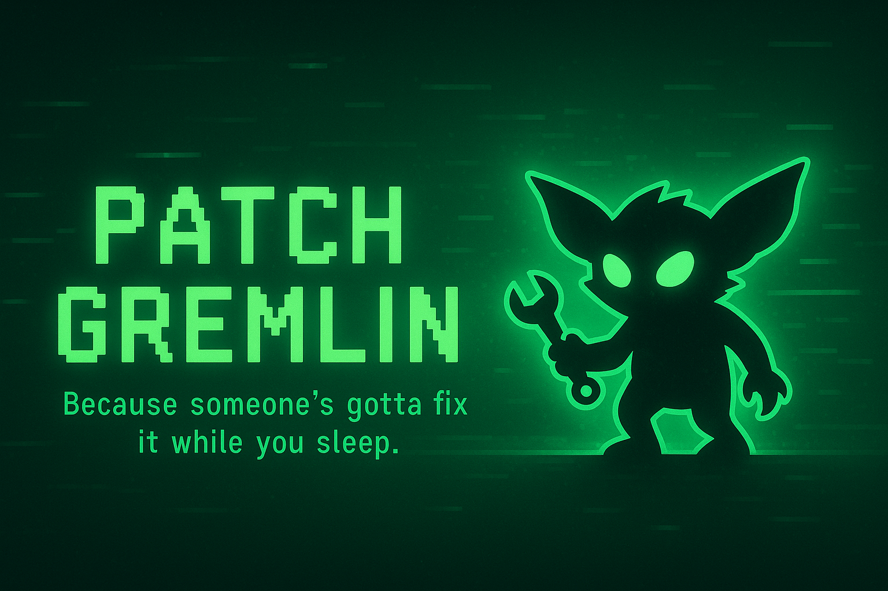

# Patch Gremlin
<div align="center">
  
</div>


Automated system update notifications for Debian and RHEL-based systems with Discord, Microsoft Teams, Slack, and Matrix support. Integrates with `unattended-upgrades` (Debian/Ubuntu) or `dnf-automatic` (RHEL/Fedora/Amazon Linux) to send notifications when security updates are installed.

## Features

- 🔔 **Multi-Platform**: Send notifications to Discord, Microsoft Teams, Slack, and/or Matrix (any combination!)
- 🔒 **Secure**: Uses Doppler CLI for credential management
- 🎨 **Configurable**: Customize Doppler secret names to avoid conflicts
- ⚙️ **Automated**: Integrates with unattended-upgrades and systemd
- 🧠 **Intelligent**: Analyzes logs to distinguish between "5 packages updated" vs "no updates available"
- 📊 **Informative**: Rich notifications with hostname, timezone-aware timestamps, and logs
- 🌍 **Timezone-Aware**: Detects and configures system timezone during setup
- 🔐 **Simple Auth**: Matrix uses username/password (no token generation needed)
- 🖥️ **Multi-OS**: Supports Debian/Ubuntu and RHEL/Rocky/AlmaLinux/Amazon Linux/Fedora

## Quick Start

### 1. Install Dependencies

```bash
# Install Doppler CLI
curl -sLf https://cli.doppler.com/install.sh | sh

# Authenticate (both user and root need separate authentication)
doppler login
sudo doppler login
```

### 2. Configure Doppler

```bash
# Setup Doppler project
sudo doppler setup --project your-project --config your-config

# Add secrets for your chosen platform(s) - use any combination!

# Discord (webhook URL from Discord server settings)
doppler secrets set SYSTEM_UPDATE_DISCORD="https://discord.com/api/webhooks/..."

# Microsoft Teams (webhook URL from Teams channel connectors)
doppler secrets set SYSTEM_UPDATE_TEAMS="https://outlook.office.com/webhook/..."

# Slack (webhook URL from Slack app)
doppler secrets set SYSTEM_UPDATE_SLACK="https://hooks.slack.com/services/..."

# Matrix (username/password - simpler than access tokens)
doppler secrets set MATRIX_HOMESERVER="https://matrix.org"
doppler secrets set MATRIX_USERNAME="youruser"  # Just username, not @user:server
doppler secrets set MATRIX_PASSWORD="your-password"
doppler secrets set SYSTEM_UPDATE_MATRIX_ROOM="!roomid:matrix.org"
```

### 3. Configure Secret Names

```bash
# Copy example config and customize
cp config.example.sh config.sh
nano config.sh
```

Edit to match your Doppler secret names:
```bash
# Configure one or more platforms (any combination works!)
export DOPPLER_DISCORD_SECRET="SYSTEM_UPDATE_DISCORD"
export DOPPLER_TEAMS_SECRET="SYSTEM_UPDATE_TEAMS"
export DOPPLER_SLACK_SECRET="SYSTEM_UPDATE_SLACK"
export DOPPLER_MATRIX_HOMESERVER_SECRET="MATRIX_HOMESERVER"
export DOPPLER_MATRIX_USERNAME_SECRET="MATRIX_USERNAME"
export DOPPLER_MATRIX_PASSWORD_SECRET="MATRIX_PASSWORD"
export DOPPLER_MATRIX_ROOM_ID_SECRET="SYSTEM_UPDATE_MATRIX_ROOM"
```

### 4. Install

```bash
# Source your config to set environment variables
source config.sh

# Run setup (with -E to preserve environment variables)
sudo -E ./setup-unattended-upgrades.sh
```

**Note**: The `source config.sh` step is only needed during setup. The setup script will permanently embed your custom secret names into the systemd service, so they'll persist across reboots without needing to source the config file again.

The setup script will:
- Install and configure unattended-upgrades (Debian) or dnf-automatic (RHEL)
- Configure timezone (detects current, offers common options)
- Embed your custom Doppler secret names into the systemd service
- Install notification script to `/usr/local/bin/`
- Create systemd service and timer with your specified schedule
- Setup post-upgrade hooks (APT or DNF)

### 5. Test

```bash
# Source config for testing (if using custom secret names)
source config.sh

# Verify installation
sudo -E ./test-setup.sh

# Test notification manually
sudo /usr/local/bin/update-notifier.sh
```

## How It Works

1. **unattended-upgrades** automatically installs security updates
2. **APT hook** triggers notification script after upgrades complete
3. **systemd timer** provides backup daily notifications
4. **Notification script**:
   - Loads config from `/etc/update-notifier/config.sh`
   - Retrieves credentials from Doppler using custom secret names
   - Sends formatted notifications to configured platforms

## Files Installed

**All Systems:**
```
/usr/local/bin/update-notifier.sh          # Main notification script
/etc/update-notifier/config.sh             # Custom secret name configuration
/etc/systemd/system/update-notifier.service # Systemd service
/etc/systemd/system/update-notifier.timer   # Daily timer
```

**Debian/Ubuntu:**
```
/etc/apt/apt.conf.d/99patch-gremlin-notification  # APT hook
/etc/apt/apt.conf.d/50unattended-upgrades         # Security update config
/etc/apt/apt.conf.d/20auto-upgrades               # Auto-upgrade schedule
```

**RHEL/Fedora/Amazon Linux:**
```
/etc/dnf/automatic.conf                                    # DNF automatic config
/usr/local/bin/patch-gremlin-dnf-hook.sh                  # Post-transaction hook
/etc/systemd/system/dnf-automatic.service.d/patch-gremlin.conf  # Service override
```

## Configuration

### Notification Types

Patch Gremlin provides intelligent notifications based on what actually happened:

- **🟢 Updates Applied**: "System Updates Applied on [hostname]" - when packages were actually installed
- **🔵 No Updates**: "System Update Check Complete on [hostname]" - when no updates were available
- **🟡 Unknown Status**: "System Update Process Complete on [hostname]" - when status is unclear

All notifications include:
- Timezone-aware timestamps (e.g., "2024-01-15 14:30:25 EST")
- Package count when available (e.g., "5 package(s) updated")
- Recent log entries for troubleshooting

### Timezone Configuration

During setup, the script will:
1. Detect your current timezone
2. Ask if you want to change it
3. Offer common timezone options:
   - US timezones (Eastern, Central, Mountain, Pacific)
   - European timezones (London, Paris)
   - Asia/Tokyo, UTC
   - Manual entry option

To preset timezone: `export SYSTEM_TIMEZONE=skip` before running setup.

### Doppler Secret Names

The script supports custom Doppler secret names via `config.sh`. This allows you to:
- Avoid conflicts with other applications
- Use consistent naming across your infrastructure
- Namespace secrets by hostname or environment

**Default names** (if no config.sh):
- `UPDATE_NOTIFIER_DISCORD_WEBHOOK`
- `UPDATE_NOTIFIER_TEAMS_WEBHOOK`
- `UPDATE_NOTIFIER_SLACK_WEBHOOK`
- `UPDATE_NOTIFIER_MATRIX_HOMESERVER`
- `UPDATE_NOTIFIER_MATRIX_USERNAME`
- `UPDATE_NOTIFIER_MATRIX_PASSWORD`
- `UPDATE_NOTIFIER_MATRIX_ROOM_ID`

**Custom names** (via config.sh):
```bash
export DOPPLER_DISCORD_SECRET="SYSTEM_UPDATE_DISCORD"
export DOPPLER_TEAMS_SECRET="SYSTEM_UPDATE_TEAMS"
export DOPPLER_SLACK_SECRET="SYSTEM_UPDATE_SLACK"
export DOPPLER_MATRIX_HOMESERVER_SECRET="MATRIX_HOMESERVER"
# ... etc
```

### Messaging Platform Setup

**Discord:**
1. Go to Server Settings → Integrations → Webhooks
2. Create webhook, copy URL
3. Add to Doppler: `doppler secrets set SYSTEM_UPDATE_DISCORD="<webhook-url>"`

**Microsoft Teams:**
1. Go to channel → Connectors → Incoming Webhook
2. Configure webhook, copy URL
3. Add to Doppler: `doppler secrets set SYSTEM_UPDATE_TEAMS="<webhook-url>"`

**Slack:**
1. Create Slack app with Incoming Webhook
2. Install to workspace, copy webhook URL
3. Add to Doppler: `doppler secrets set SYSTEM_UPDATE_SLACK="<webhook-url>"`

**Matrix:**
See [MATRIX_SETUP.md](MATRIX_SETUP.md) for detailed instructions.

### Matrix Username Format

In Doppler, store just the **localpart** of your Matrix username (without `@` or `:homeserver`):
- ✅ Correct: `username`
- ❌ Wrong: `@username:matrix.org`

The script will automatically extract the localpart if you accidentally include the full format.

## Files Installed

```
/usr/local/bin/update-notifier.sh          # Main notification script
/etc/update-notifier/config.sh             # Custom secret name configuration
/etc/systemd/system/update-notifier.service # Systemd service
/etc/systemd/system/update-notifier.timer   # Daily timer
/etc/apt/apt.conf.d/99discord-notification  # APT hook
/etc/apt/apt.conf.d/50unattended-upgrades   # Security update config
```

## Troubleshooting

### Config not loading

```bash
# Ensure config exists in system location
sudo cp ~/src/scripts/config.sh /etc/update-notifier/config.sh
sudo chmod 644 /etc/update-notifier/config.sh
```

### Doppler authentication lost after reboot

Doppler stores auth in `/root/.doppler/` which persists across reboots. If you see auth errors:
```bash
sudo doppler login
sudo doppler setup --project your-project --config your-config
```

### Hostname resolution error after changing hostname

Update `/etc/hosts`:
```bash
sudo nano /etc/hosts
# Change old hostname to new hostname on the 127.0.1.1 line
```

### Matrix login fails

Check your username format in Doppler:
```bash
doppler secrets get MATRIX_USERNAME --plain
# Should show just "username", not "@username:server"
```

## Uninstallation

```bash
sudo ./uninstall.sh
```

## Documentation

- **[QUICK_REFERENCE.md](QUICK_REFERENCE.md)** - Command cheat sheet
- **[MATRIX_SETUP.md](MATRIX_SETUP.md)** - Matrix-specific setup
- **[TROUBLESHOOTING.md](TROUBLESHOOTING.md)** - Detailed troubleshooting

## Requirements

- Debian 12+ (Bookworm/Trixie) OR RHEL 8+/Rocky/AlmaLinux/Amazon Linux 2023/Fedora
- Root/sudo access
- Doppler CLI
- Discord webhook URL and/or Matrix account

## Supported Operating Systems

**Debian-based:**
- Debian 12 (Bookworm), 13 (Trixie)
- Ubuntu 20.04+
- Other Debian derivatives

**RHEL-based:**
- Red Hat Enterprise Linux 8+
- Rocky Linux 8+
- AlmaLinux 8+
- Amazon Linux 2023
- Fedora 35+

## How It Works

**Debian/Ubuntu:**
1. **unattended-upgrades** automatically installs security updates
2. **APT hook** triggers notification script after upgrades complete
3. **systemd timer** provides backup daily notifications

**RHEL/Fedora/Amazon Linux:**
1. **dnf-automatic** automatically installs security updates
2. **systemd service hook** triggers notification script after upgrades complete
3. **dnf-automatic.timer** runs daily (configured by dnf-automatic)

**Both systems:**
- **Notification script**:
  - Loads config from `/etc/update-notifier/config.sh`
  - Retrieves credentials from Doppler using custom secret names
  - Analyzes log files to determine actual update status
  - Sends intelligent notifications with appropriate titles and colors
  - Includes timezone-aware timestamps and package counts

## License

**Dual License:** MPL-2.0 OR Commercial

- **Open Source Use:** Licensed under the Mozilla Public License 2.0 (MPL-2.0)
- **Commercial Use:** IF planning on modifying, requires contacting [@ChiefGyk3D](https://github.com/ChiefGyk3D)
  - Most requests approved free of charge with the condition that improvements be contributed back
  - See [LICENSE](LICENSE) for full details

## Contributing

Issues and pull requests welcome! By contributing, you agree to license your contributions under the same dual license (MPL-2.0 / Commercial).

---

## 💬 Community & Support

### Get Involved

- **⭐ Star the repo** - Show your support!
- **📢 Share** - Tell other sysadmins about Patch Gremlin
- **🐛 Report bugs** - Help us improve quality
- **💡 Request features** - Share your ideas
- **🔧 Contribute** - Submit pull requests
- **📖 Improve docs** - Help others get started

### Community Channels

- **[GitHub Discussions](https://github.com/ChiefGyk3D/Patch-Gremlin/discussions)** - Ask questions, share setups
- **[GitHub Issues](https://github.com/ChiefGyk3D/Patch-Gremlin/issues)** - Bug reports and feature requests
- **[Pull Requests](https://github.com/ChiefGyk3D/Patch-Gremlin/pulls)** - Contribute code and improvements

### Stay Updated

- **Watch releases** - Get notified of new versions
- **Follow development** - Track progress on roadmap items
- **Join discussions** - Participate in feature planning

---

## 💝 Donations and Tips

If you find Patch Gremlin useful, consider supporting development:

**Donate**:

<div align="center">
  <table>
    <tr>
      <td align="center"><a href="https://patreon.com/chiefgyk3d?utm_medium=unknown&utm_source=join_link&utm_campaign=creatorshare_creator&utm_content=copyLink" title="Patreon"></a></td>
      <td align="center"><a href="https://streamelements.com/chiefgyk3d/tip" title="StreamElements"></a></td>
    </tr>
    <tr>
      <td align="center">Patreon</td>
      <td align="center">StreamElements</td>
    </tr>
  </table>
</div>

### Cryptocurrency Tips

<div align="center">
  <table style="border:none;">
    <tr>
      <td align="center" style="padding:8px; min-width:120px;">
        
      </td>
      <td align="left" style="padding:8px;">
        <b>Bitcoin</b><br/>
        <code style="font-size:12px;">bc1qztdzcy2wyavj2tsuandu4p0tcklzttvdnzalla</code>
      </td>
    </tr>
    <tr>
      <td align="center" style="padding:8px; min-width:120px;">
        
      </td>
      <td align="left" style="padding:8px;">
        <b>Monero</b><br/>
        <code style="font-size:12px;">84Y34QubRwQYK2HNviezeH9r6aRcPvgWmKtDkN3EwiuVbp6sNLhm9ffRgs6BA9X1n9jY7wEN16ZEpiEngZbecXseUrW8SeQ</code>
      </td>
    </tr>
    <tr>
      <td align="center" style="padding:8px; min-width:120px;">
        
      </td>
      <td align="left" style="padding:8px;">
        <b>Ethereum</b><br/>
        <code style="font-size:12px;">0x554f18cfB684889c3A60219BDBE7b050C39335ED</code>
      </td>
    </tr>
  </table>
</div>

---

<div align="center">

Made with ❤️ by [ChiefGyk3D](https://github.com/ChiefGyk3D)

## Author & Socials

<table>
  <tr>
    <td align="center"><a href="https://social.chiefgyk3d.com/@chiefgyk3d" title="Mastodon"></a></td>
    <td align="center"><a href="https://bsky.app/profile/chiefgyk3d.com" title="Bluesky"></a></td>
    <td align="center"><a href="http://twitch.tv/chiefgyk3d" title="Twitch"></a></td>
    <td align="center"><a href="https://www.youtube.com/channel/UCvFY4KyqVBuYd7JAl3NRyiQ" title="YouTube"></a></td>
    <td align="center"><a href="https://kick.com/chiefgyk3d" title="Kick"></a></td>
    <td align="center"><a href="https://www.tiktok.com/@chiefgyk3d" title="TikTok"></a></td>
    <td align="center"><a href="https://discord.chiefgyk3d.com" title="Discord"></a></td>
    <td align="center"><a href="https://matrix-invite.chiefgyk3d.com" title="Matrix"></a></td>
  </tr>
  <tr>
    <td align="center">Mastodon</td>
    <td align="center">Bluesky</td>
    <td align="center">Twitch</td>
    <td align="center">YouTube</td>
    <td align="center">Kick</td>
    <td align="center">TikTok</td>
    <td align="center">Discord</td>
    <td align="center">Matrix</td>
  </tr>
</table>

<sub>ChiefGyk3D is the author of Patch Gremlin</sub>

</div>
